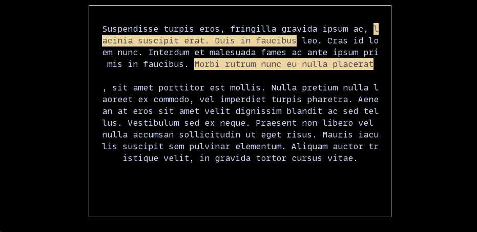
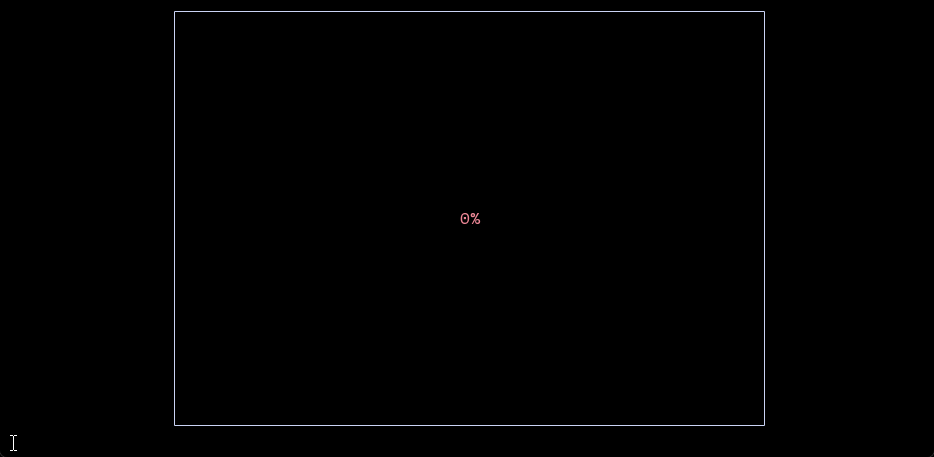
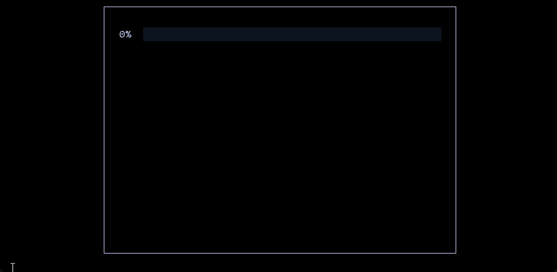
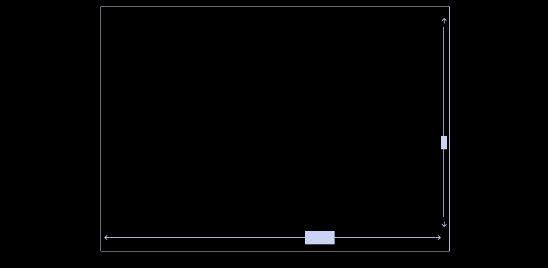
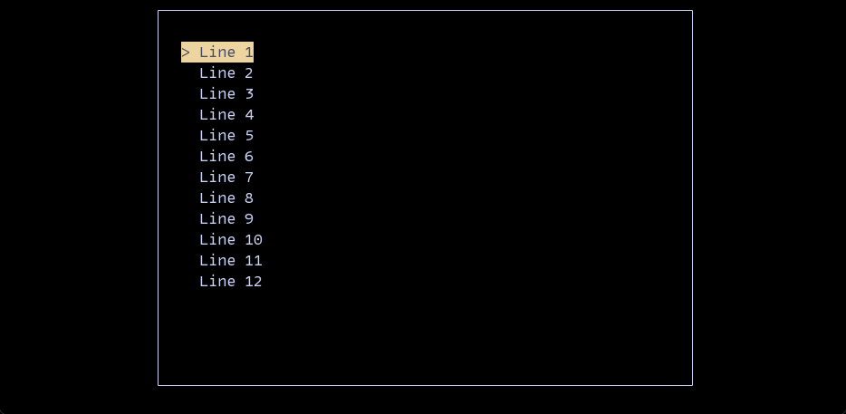
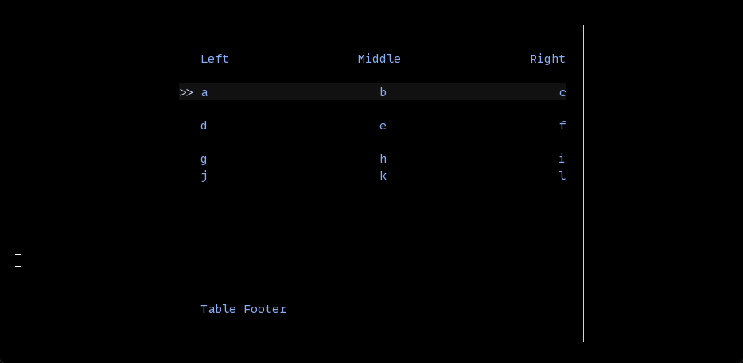

# zuit

Zig TUI library built from scratch only in zig

This library was greatly influenced from the rust [Ratatui](https://ratatui.rs/) crate. The goal is to keep the heap allocations minimal
while providing an easy to use api for immediate mode rendering.

## Installation

```
zig fetch --save git+https://github.com/Tired-Fox/zuit#{commit|tag|branch}
```

```zig
const zuit = b.dependency("zuit", .{
    .target = target,
    .optimize = optimize,
});
exe.root_module.addImport("zuit", zuit.module("zuit"));
```

## Widgets

### Block

Base widget used as a container to create a border with titles, while also adding padding to it's contents

```zig
const Block = zuit.widget.Block;
Block {
    .titles = &.{
        .{ .text = "top_left" },
        .{ .text = "top_center", .position = .top_center, .style = .{ .fg = .green } },
        .{ .text = "top_right", .position = .top_right },
        .{ .text = "bottom_left", .position = .bottom_left },
        .{ .text = "bottom_center", .position = .bottom_center },
        .{ .text = "bottom_right", .position = .bottom_right },
        // ...
    },
    .borders = .all,
    .set = zuig.symbols.border.DOUBLE,
    // .set = .{ .left = '|', .top_left = '#', ...  }
    .padding = .proportional(1),
    .title_style = .{ .fg = .red },
    .border_style = .{ .fg = .black },
    .style = .{ .bg = .white },
}
```


### Paragraph

Display text in user defined `lines` with styled `spans` with automatic text wrap support
and alignment support.

```zig
const Paragraph = zuit.widget.Paragraph;
const Line = zuit.widget.Line;
const Span = zuit.widget.Span;

const content: [5][]const u8 = .{
    "Suspendisse turpis eros, fringilla gravida ipsum ac, ",
    "lacinia suscipit erat. Duis in faucibus",
    " leo. Cras id lorem nunc. Interdum et malesuada fames ac ante ipsum primis in faucibus. ",
    "Morbi rutrum nunc eu nulla placerat",
    ", sit amet porttitor est mollis. Nulla pretium nulla laoreet ex commodo, vel imperdiet turpis pharetra. Aenean at eros sit amet velit dignissim blandit ac sed tellus. Vestibulum sed ex neque. Praesent non libero vel nulla accumsan sollicitudin ut eget risus. Mauris iaculis suscipit sem pulvinar elementum. Aliquam auctor tristique velit, in gravida tortor cursus vitae."
};

Paragraph {
    .lines = &.{
        Line.init(&.{
            Span.raw(content[0]),
            Span.styled(content[1], hl),
            Span.raw(content[2]),
            Span.styled(content[3], hl)
        }),
        Line.empty,
        Line.init(&.{ Span.raw(content[4]) })
    },
    .text_align = .center,
    .trim = true,
    .wrap = true,
}
```



### Gauge

Display a block progress bar with a percentage or custom label displayed in the center of the bar.

```zig
const Gauge = zuit.widget.Gauge;

Gauge {
    .progress = 0.5,
    .filled_style = .{ .fg = .black, .bg = .red },
    .unfilled_style = .{ .fg = .red },
}
```



### Line Gauge

Display a progress bar within a single line with a percentage or custom label displayed before the bar.

```zig
const LineGauge = zuit.widget.LineGauge;
LineGauge {
    .progress = 0.5,
    .set = .{ .horizontal = '█' },
    .filled_style = .{ .fg = .green },
    .unfilled_style = .{ .fg = .rgb(10, 20, 30) },
}
```



### Scrollabr

```zig
const ScrollBar = zuit.widget.ScrollBar;
State {
    .total = 10,
    .position = 6,
}
ScrollBar {
    .orientation = .HorizontalTop,
}
```



### List

Display a selectable list of stylable lines.

```zig
const List = zuit.widget.List;
List {
    .items = &.{
        Line.start(&.{ Span.raw("Line 1") }),
        Line.start(&.{ Span.raw("Line 2") }),
        Line.start(&.{ Span.raw("Line 3") }),
        Line.start(&.{ Span.raw("Line 4") }),
        // ...
    },
    .highlight_style = .{ .bg = .yellow, .fg = .black },
    .highlight_symbol = ">",
}
```



### Table

Display a table where each cell can be selected and styled.

```zig
const Table = zuit.widget.Table;
const TableState = zuit.widget.TableState;
const Row = zuit.widget.Row;
const Line = zuit.widget.Line;
const Span = zuit.widget.Span;

Table(3) {
    .constraints = @splat(.{ .fill = 1 }),
    .header = .{
        .columns = .{
            Line.start(&.{ Span.raw("Left") }),
            Line.center(&.{ Span.raw("Middle") }),
            Line.end(&.{ Span.raw("Right") })
        },
        .margin = .{ .bottom = 1 },
    },
    .footer = Row(3).raw(.{
        Line.start(&.{ Span.raw("Table Footer") }),
        Line.empty,
        Line.empty
    }),
    .rows = &.{
        Row(3).raw(.{
            Line.start(&.{ Span.raw("a") }),
            Line.center(&.{ Span.raw("b") }),
            Line.end(&.{ Span.raw("c") })
        }),
        .{
            .columns = .{
                Line.start(&.{ Span.raw("d") }),
                Line.center(&.{ Span.raw("e") }),
                Line.end(&.{ Span.raw("f") })
            },
            .margin = .symmetric(1),
        },
        Row(3).raw(.{
            Line.start(&.{ Span.raw("g") }),
            Line.center(&.{ Span.raw("h") }),
            Line.end(&.{ Span.raw("i") })
        }),
        Row(3).raw(.{
            Line.start(&.{ Span.raw("j") }),
            Line.center(&.{ Span.raw("k") }),
            Line.end(&.{ Span.raw("l") })
        })
    },
    .style = .{ .fg = .blue },
    .row_highlight_style = .{ .bg = .xterm(.grey_7) },
    .column_highlight_style = .{ .bg = .xterm(.grey_7) },
    .cell_highlight_style = .{ .bg = .xterm(.grey_19) }
}
```



## Example

```zig
const std = @import("std");
const zerm = @import("zerm");
const zuit = @import("zuit");

const widget = zuit.widget;
const Constraint = zuit.widget.Constraint;
const Layout = zuit.widget.Layout;

const Cursor = zerm.action.Cursor;
const Screen = zerm.action.Screen;
const Capture = zerm.action.Capture;
const getTermSize = zerm.action.getTermSize;

const EventStream = zerm.event.EventStream;

const Style = zerm.style.Style;

const Utf8ConsoleOutput = zerm.Utf8ConsoleOutput;
const execute = zerm.execute;

fn setup() !void {
    try Screen.enableRawMode();
    try execute(.stdout, .{
        Screen.enter_alternate_buffer,
        Cursor { .col = 1, .row = 1, .visibility = .hidden },
    });
}

fn cleanup() !void {
    try Screen.disableRawMode();
    try execute(.stdout, .{
        Cursor { .visibility = .visible },
        Screen.leave_alternate_buffer,
    });
}

pub fn main() !void {
    var gpa = std.heap.GeneralPurposeAllocator(.{}).init;
    defer if (gpa.deinit() == .leak) { std.debug.print("memory leak detected", .{}); };
    const allo = gpa.allocator();

    var stream = EventStream.init(allo);
    defer stream.deinit();

    // Used to get around issue with zig not being able to print utf-8 unicode
    // by default
    const utf8_ctx = Utf8ConsoleOutput.init();
    defer utf8_ctx.deinit();

    try setup();
    errdefer _ = Screen.disableRawMode() catch { std.log.err("error disabling raw mode", .{}); };
    defer cleanup() catch { std.log.err("error cleaning up terminal", .{}); };

    var term = try zuit.Terminal.init(allo, .stdout);
    defer term.deinit();

    var app = App{};
    try term.render(&app);

    while (true) {
        if (try stream.parseEvent()) |event| {
            switch (event) {
                .key => |key| {
                    if (key.matches(&.{ 
                        .{ .code = .char('q') },
                        .{ .code = .char('c'), .ctrl = true },
                        .{ .code = .char('C'), .ctrl = true }
                    })) break;
                },
                .resize => |resize| {
                    try term.resize(resize[0], resize[1]);
                    try term.render(&app);
                },
                else => {}
            }
        }
    }
}

const Greet = struct {
    /// This method can have any arguments, where each argument is injected based
    /// on its type.
    ///
    /// All arguments except for the `state` is provided by the library
    pub fn renderWithState(buffer: *zuit.Buffer, area: zuit.Rect, state: []const u8) !void {
        try buffer.setFormatted(area.x, area.y, .{ .fg = .green }, "Hello, {s}!", .{ state });
    }
};

const App = struct {
    /// This method can have any arguments, where each argument is injected based
    /// on its type.
    ///
    /// The name determines how it is called by the library i.e. `term.render` or `term.renderWithState`
    pub fn render(buffer: *zuit.Buffer, area: zuit.Rect) !void {
        const message = "world";

        const hoz = Layout(3).horizontal(&.{ .{ .fill = 1 }, .{ .length = message.len + 8 }, .{ .fill = 1 } })
            .split(area)[1];
        const vert = Layout(3).vertical(&.{ .{ .fill = 1 }, .{ .length = 1 }, .{ .fill = 1 } })
            .split(hoz)[1];

        try Greet.renderWithState(buffer, vert, message);
    }
};
```
