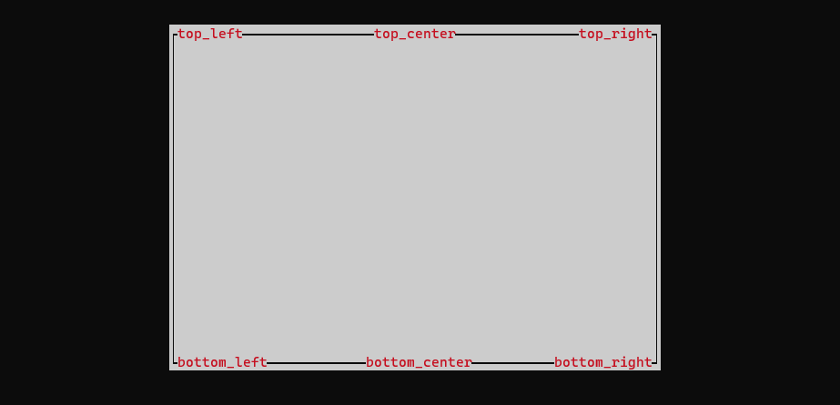

# zuit

Zig TUI library built from scratch only in zig

This library was greatly influenced from the rust [Ratatui](https://ratatui.rs/) crate. The goal is to keep the heap allocations minimal
while providing an easy to use api for immediate mode rendering.

## Widgets

### Block

Base widget used as a container to create a border with titles, while also adding padding to it's contents

```zig
pub const Block = zuit.widget.Block;
Block {
    .titles = &.{
        .{ .text = "top_left" },
        .{ .text = "top_center", .position = .top_center, .style = .{ .fg = .green } },
        .{ .text = "top_right", .position = .top_right },
        .{ .text = "bottom_left", .position = .bottom_left },
        .{ .text = "bottom_center", .position = .bottom_center },
        .{ .text = "bottom_right", .position = .bottom_right },
        // ...
    },
    .borders = .all,
    .set = zuig.symbols.border.DOUBLE,
    // .set = .{ .left = '|', .top_left = '#', ...  }
    .padding = .proportional(1),
    .title_style = .{ .fg = .red },
    .border_style = .{ .fg = .black },
    .style = .{ .bg = .white },
}
```



### Paragraph

Display text in user defined `lines` with styled `spans` with automatic text wrap support
and alignment support.

```zig
pub const Paragraph = zuit.widget.Paragraph;
pub const Line = zuit.widget.Line;
pub const Span = zuit.widget.Span;

Paragraph {
    .lines = &.{
        Line.init(&.{ Span.styled("Hello, ", .{ .fg = .red }) }),
        Line.empty,
        Line.init(&.{ Span.raw("world") }),
    },
    .text_align = .center,
    .trim = true,
    .wrap = true,
}
```

```zig
pub const Gauge = @import("./widget/gauge.zig").Gauge;
```

```zig
pub const LineGauge = @import("./widget/gauge.zig").LineGauge;
```

```zig
pub const ScrollBar = @import("./widget/scroll.zig").ScrollBar;
```

```zig
pub const List = @import("./widget/list.zig").List;
```

```zig
pub const Table = @import("./widget/table.zig").Table;
```

## Example

```zig
const std = @import("std");
const zerm = @import("zerm");
const zuit = @import("zuit");

const widget = zuit.widget;
const Constraint = zuit.widget.Constraint;
const Layout = zuit.widget.Layout;

const Cursor = zerm.action.Cursor;
const Screen = zerm.action.Screen;
const Capture = zerm.action.Capture;
const getTermSize = zerm.action.getTermSize;

const EventStream = zerm.event.EventStream;

const Style = zerm.style.Style;

const Utf8ConsoleOutput = zerm.Utf8ConsoleOutput;
const execute = zerm.execute;

fn setup() !void {
    try Screen.enableRawMode();
    try execute(.stdout, .{
        Screen.enter_alternate_buffer,
        Cursor { .col = 1, .row = 1, .visibility = .hidden },
    });
}

fn cleanup() !void {
    try Screen.disableRawMode();
    try execute(.stdout, .{
        Cursor { .visibility = .visible },
        Screen.leave_alternate_buffer,
    });
}

pub fn main() !void {
    var gpa = std.heap.GeneralPurposeAllocator(.{}).init;
    defer if (gpa.deinit() == .leak) { std.debug.print("memory leak detected", .{}); };
    const allo = gpa.allocator();

    var stream = EventStream.init(allo);
    defer stream.deinit();

    // Used to get around issue with zig not being able to print utf-8 unicode
    // by default
    const utf8_ctx = Utf8ConsoleOutput.init();
    defer utf8_ctx.deinit();

    try setup();
    errdefer _ = Screen.disableRawMode() catch { std.log.err("error disabling raw mode", .{}); };
    defer cleanup() catch { std.log.err("error cleaning up terminal", .{}); };

    var term = try zuit.Terminal.init(allo, .stdout);
    defer term.deinit();

    var app = App{};
    try term.render(&app);

    while (true) {
        if (try stream.parseEvent()) |event| {
            switch (event) {
                .key => |key| {
                    if (key.matches(&.{ 
                        .{ .code = .char('q') },
                        .{ .code = .char('c'), .ctrl = true },
                        .{ .code = .char('C'), .ctrl = true }
                    })) break;
                },
                .resize => |resize| {
                    try term.resize(resize[0], resize[1]);
                    try term.render(&app);
                },
                else => {}
            }
        }
    }
}

const Greet = struct {
    /// This method can have any arguments, where each argument is injected based
    /// on its type.
    ///
    /// All arguments except for the `state` is provided by the library
    pub fn renderWithState(buffer: *zuit.Buffer, area: zuit.Rect, state: []const u8) !void {
        try buffer.setFormatted(area.x, area.y, .{ .fg = .green }, "Hello, {s}!", .{ state });
    }
};

const App = struct {
    /// This method can have any arguments, where each argument is injected based
    /// on its type.
    ///
    /// The name determines how it is called by the library i.e. `term.render` or `term.renderWithState`
    pub fn render(buffer: *zuit.Buffer, area: zuit.Rect) !void {
        const message = "world";

        try widget.Clear.render(buffer, area);
        const hoz = Layout(3).horizontal(&.{ .{ .fill = 1 }, .{ .length = message.len + 8 }, .{ .fill = 1 } })
            .split(area)[1];
        const vert = Layout(3).vertical(&.{ .{ .fill = 1 }, .{ .length = 1 }, .{ .fill = 1 } })
            .split(hoz)[1];

        try Greet.renderWithState(buffer, vert, message);
    }
};
```
